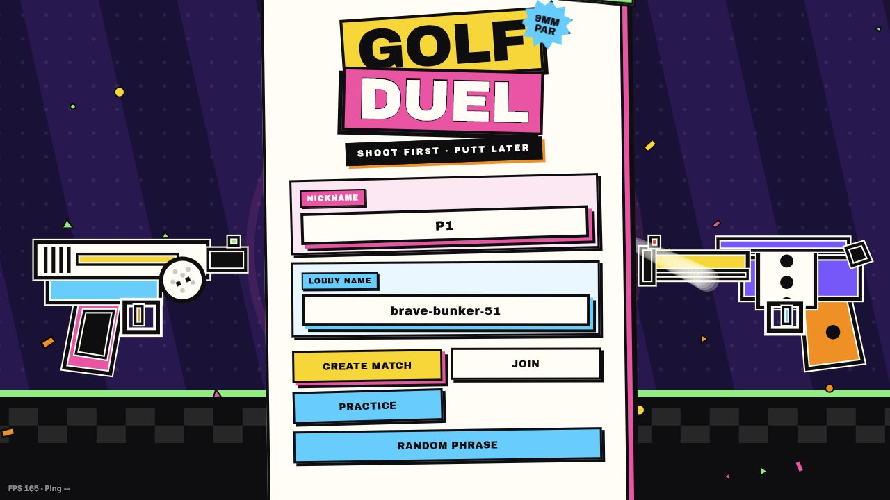
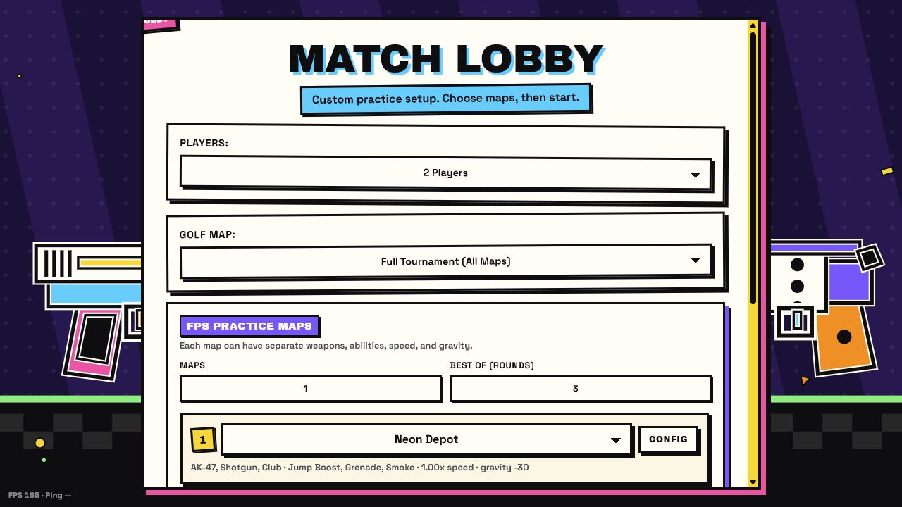
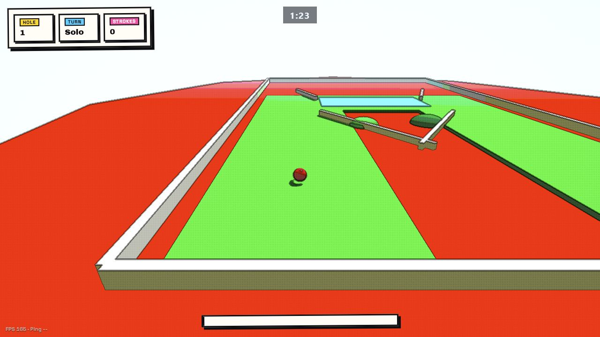
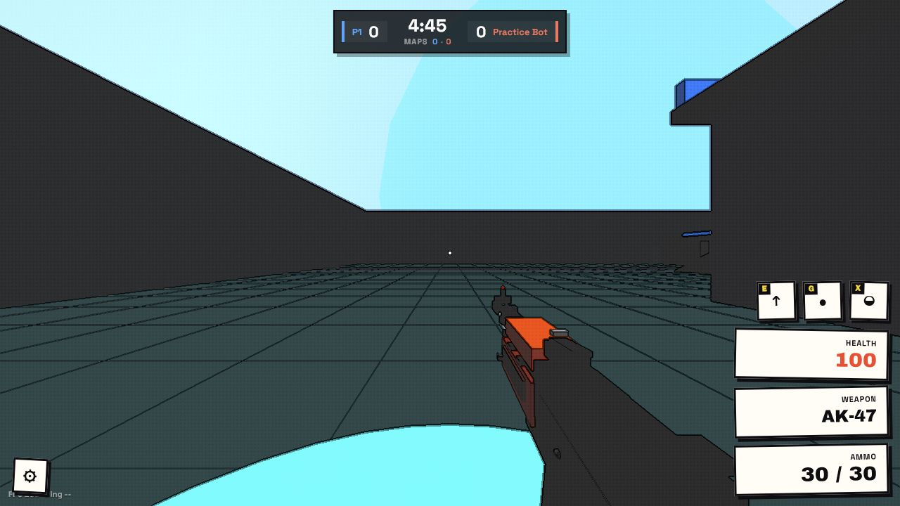

# GolfShooter

GolfShooter is the repo for **Golf Duel**, a loud browser game that starts with
turn-based 3D mini golf and can snap into arena FPS duels when the scorecard
needs settling. It runs as static files, loads its maps and weapon tuning from
JSON, and supports solo practice or peer-to-peer multiplayer lobbies.



## What is in here

- 3D mini golf holes with ramps, bumpers, ice, launchers, death zones, timers,
  and multi-player scorecards.
- First-person arena rounds with bots in practice, loadouts, abilities,
  scoreboard rounds, kill notices, final-kill/defeat screens, and custom match
  setup.
- PeerJS lobby discovery with direct browser-to-browser WebRTC gameplay traffic.
- Data-driven maps, tournaments, weapons, and loadouts that can be edited without
  rebuilding the app.
- A no-build static frontend using Three.js from an import map and PeerJS from a
  CDN.

## Screenshots







## Run locally

Use the bundled static server:

```powershell
npm start
```

Then open:

```text
http://127.0.0.1:4173/
```

`npm start` serves the game and starts the local STUN helper from
`scripts/stun-server.cjs`. The game still defaults to public STUN servers unless
you configure extra ICE/STUN settings.

You can also use any plain static file server:

```powershell
python -m http.server 4173
```

No bundling step is required. The page does need network access for CDN assets
unless you vendor Three.js, PeerJS, and fonts locally.

## Play

From the menu:

- **Create Match** hosts a lobby with the current lobby phrase.
- **Join** connects to another host using the same phrase.
- **Practice** starts a local lobby with solo golf and FPS bot practice.
- **Random Phrase** creates a fresh lobby name.

Lobby modes:

- **Full Tournament** plays the complete golf tournament. In a networked match,
  a tied golf scorecard launches a randomized FPS tiebreaker.
- **FPS Duel** starts straight in a randomized shooter match.
- **Custom** exposes player count, golf course selection, FPS map count,
  best-of rounds, per-map loadouts, abilities, speed, gravity, and custom map
  upload. Use **Golf + FPS** there when you want golf to always feed into a
  configured shooter leg.

Golf controls:

- Drag from the ball and release to shoot.
- Hold `Space` to charge, use `ArrowLeft` / `ArrowRight` to aim, and release
  `Space` to shoot.

FPS controls:

- Click the canvas to capture mouse look.
- `WASD` moves, `Space` jumps, and `Shift` / `Ctrl` slides.
- Left mouse fires. Right mouse aims, or starts a parry guard for parry-capable
  melee weapons.
- `R` reloads.
- Number keys choose weapons. Arrow keys can cycle weapon choices in supported
  match states.
- Ability keys are shown in the HUD and can be remapped from the pause panel.
  Defaults include `Q` heal, `E` jump boost, `G` grenade, `X` smoke, `C` radar,
  `V` dash, `F` grapple, and `Space` jetpack.
- `Esc` opens the pause/settings panel for sensitivity, FOV, mouse fix, ability
  keys, and leaving the match.

## Content layout

Core runtime:

- `index.html` - canvas, menus, HUD, overlays, import map, and app entry script.
- `css/style.css` and `css/parts/*.css` - comic-styled UI and HUD.
- `js/main.js` - startup sequence.
- `js/app/*.js` - menu flow, input, golf/FPS runtime, HUD, bots, networking
  glue, match results, and visual effects.
- `js/core/*.js` - shared state, constants, engine helpers, network transport,
  ramps, and utilities.
- `js/golf/*.js` and `js/fps/*.js` - mode-specific logic and scene building.

Game data:

- `maps/manifest.json` - registered golf and FPS maps.
- `maps/golf/*.json` - mini golf holes.
- `maps/fps/*.json` - FPS arenas.
- `maps/fps/<map>/*.json` - chunked arena geometry used by larger maps.
- `assets/weapons/weapons.json` - weapon stats and weapon pools.
- `assets/weapons/loadouts.json` - reusable health, speed, and ability presets.
- `assets/tournaments/*.json` - named FPS map/loadout combinations.
- `assets/tournaments/manifest.json` - tournament combination registry.

Tools and notes:

- `scripts/glb-to-fps-map.mjs` converts GLB/GLTF assets into FPS map JSON.
- `scripts/check-fps-ramp-usability.mjs maps/fps/<map>.json` checks ramp support,
  slope, and blocking geometry.
- `maps/fps/DETAIL_GUIDE.md` documents FPS map detail conventions.
- `webrtc_stun_guide.md` has deeper WebRTC/STUN notes.
- `copy-game-to-website.ps1` helps copy the current game into another site.

## Multiplayer notes

Multiplayer uses PeerJS for brokered discovery and then sends gameplay over
direct WebRTC data connections. There is no database, account system, server-side
matchmaking, or authoritative game backend.

By default, the browser uses free public STUN servers such as Google's STUN
hosts and Mozilla's STUN service. STUN helps peers discover routable addresses;
it does not relay traffic. Strict NATs may still need TURN. You can provide
custom ICE servers with:

```js
window.GOLF_DUEL_ICE_SERVERS = [
  { urls: "turn:turn.example.com:3478", username: "user", credential: "pass" }
];
```

Or add extra STUN URLs with:

```js
window.GOLF_DUEL_STUN_URLS = ["stun:example.com:3478"];
```

The same values can be persisted with `localStorage.golfDuelIceServers` and
`localStorage.golfDuelStunUrls`.

## Deploy

Deploy the folder as static files to Cloudflare Pages, GitHub Pages, Netlify, or
any CDN/static host that allows the CDN scripts used by `index.html`. For a fully
offline or self-hosted deployment, vendor the external scripts and update the
import map/script tags.

## License

MIT. See [LICENSE](LICENSE).
